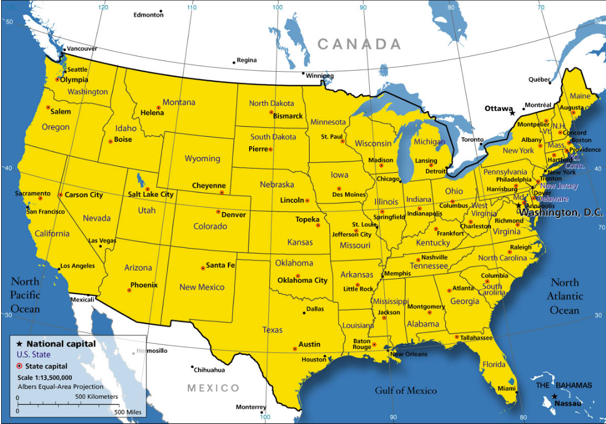
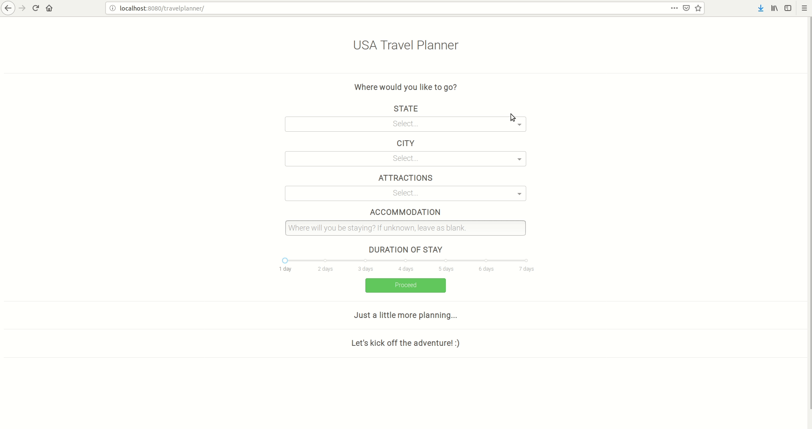
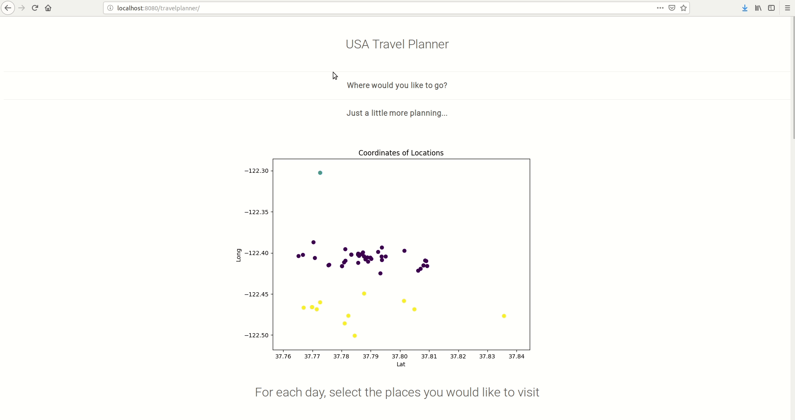
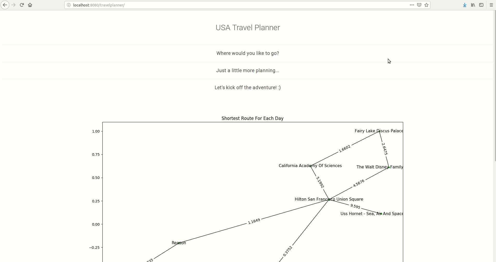

# usa-travel-planner

[](https://www.repostatus.org/#inactive)
[](https://img.shields.io/github/license/jordan396/usa-travel-planner.svg)
[](https://img.shields.io/github/last-commit/jordan396/usa-travel-planner/master.svg)
[](https://img.shields.io/github/repo-size/jordan396/usa-travel-planner.svg)
[](https://img.shields.io/github/followers/jordan396.svg?label=Follow)

## Project Overview



Suppose you're planning a trip to San Francisco this summer. You've heard all about this amazing place - the Golden Gate Bridge, Fisherman's Wharf, Alcatraz Island - you simply can't wait to see them all! Unfortunately, you don't have enough time to visit every attraction... so, _how do you maximize the number of places to visit within a limited amount of time?_ 

This web application has been designed to solve this problem. Simply tell it where you'd like to go, and you'll be sent your very own itinerary!

## Problem Explanation
If this problem sounds familiar, you've probably heard of the [Travelling Salesman Problem](https://en.wikipedia.org/wiki/Travelling_salesman_problem). In this NP-Hard problem, if we were to consider calculating the length of _all possible routes_, we'd end up with a time complexity of _O(n!)_. In other words, it's going to take an extremely long time before we find the answer! 

One way to overcome this issue is to use _Heuristics_, which are approximation algorithms that provide answers close to the optimal solution. Here, I've implemented the [_Greedy heuristic_](http://160592857366.free.fr/joe/ebooks/ShareData/Heuristics%20for%20the%20Traveling%20Salesman%20Problem%20By%20Christian%20Nillson.pdf), otherwise known as the _shortest links heuristic_. This works by constructing a graph based on the establishing shortest links between nodes without creating cycles prior to completion of the algorithm. The time complexity of this heuristic is _O(n<sup>2</sup>log<sub>2</sub>(n))_ which is significantly lower than _O(n!)_.

## Application Details
This web application relies on **Flask** as the web framework. The user interface has been designed using **Dash by Plotly**, and the list of Cities are stored in **DynamoDB**.

### Step One

Select the destination and the attractions you'd like to visit, as well as the place you will be staying and the length of your stay. Click _Proceed_.
  - In the backend, the application uses **Google Places API** to identify all selected attractions in your accomodation vicinity. 
    * It then performs _K-means clustering_ using **sklearn**, where 'K' represents the duration of your stay, to group attractions based on their coordinates.
    * A scatterplot of the clustered locations will be displayed.

### Step Two

For each day of your stay, select the attractions you'd like to see by clicking the _checkbox_ of the attraction. Once done, click _Select_.
  * The application then performs the _Greedy TSP heuristic_.
  * Routes for each day is captured in a **networkx** graph plot.

### Step Three

For ease of reference, click on _Download_ to download an _Excel_ file containing the routes in a user-friendly format.
  * Excel files are stored in an **Amazon S3** bucket which is accessed using **Boto3**.

## Installation and Deployment
### 1) Pre-conditions
You'll need to create an AWS account to interact with DynamoDB and S3. Take note of your AWS [credentials](https://docs.aws.amazon.com/general/latest/gr/aws-sec-cred-types.html) - we'll need it later.

Next, you'll need credentials for the Google Places API which can be obtained [here](https://developers.google.com/places/web-service/intro).

### 2) Setting up the Environment
Once you SSH into your server, clone this repository.

`git clone https://github.com/Jordan396/usa-travel-planner.git`

`cd usa-travel-planner/`

Create a virtualenv and install dependencies:
```
python3 -m virtualenv venv
source venv/bin/activate
pip install -r requirements.txt
```

Create a new file called _config.py_.

`vim config.py`

Insert your credentials (from step 1) accordingly:
```
AWS_SECRET_ACCESS_KEY = [YOUR AWS_SECRET_ACCESS_KEY]
AWS_ACCESS_KEY_ID = [YOUR AWS_ACCESS_KEY_ID]
GOOGLE_MAPS_API_KEY = [YOUR GOOGLE_MAPS_API_KEY]
AWS_REGION_NAME = [YOUR AWS_REGION_NAME]
```

### 3) Run Application

```
python index.py
```
There you have it! You can access your web application at `localhost:5000/travelplanner`.
